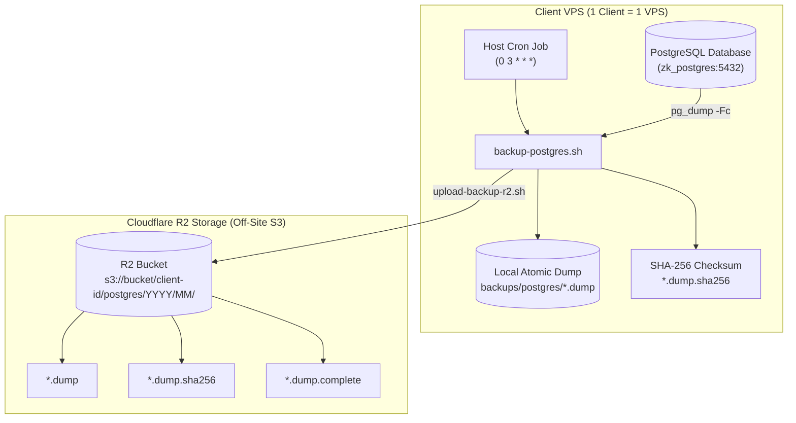

# PostgreSQL Backup & Disaster Recovery Runbook

**Attendance System — Commercial Edition**

This runbook documents the architecture, automated scheduling, manual operations, and disaster recovery procedures for PostgreSQL backups.

---

## 1. Architecture Overview



### Core Principles
- **One Client = One VPS:** Each client installation maintains its own isolated database, local backup archive, and dedicated R2 prefix (`<BACKUP_CLIENT_ID>/postgres/YYYY/MM/`).
- **Atomic Creation:** Dumps are written to `.dump.partial` first, validated with `pg_restore --list`, and atomically renamed only upon validation.
- **Mandatory Integrity:** Every backup is accompanied by a SHA-256 sidecar (`.dump.sha256`).
- **Off-Site Atomicity:** Remote uploads place `.dump`, `.sha256`, and a final `.complete` JSON metadata marker, verifying remote existence and byte size.
- **Active Database Protection:** Restore scripts explicitly refuse to overwrite the live active database (`POSTGRES_DB`).

---

## 2. Configuration & Credentials

### Local Environment (`.env.docker`)
Contains PostgreSQL connection details used by the Docker stack:
```bash
POSTGRES_DB=attendance
POSTGRES_USER=attendance_user
POSTGRES_PASSWORD=your_strong_password
```

### Off-Site R2 Environment (`.env.backup`)
Copy `.env.backup.example` to `.env.backup` on the host:
```bash
cp .env.backup.example .env.backup
```

Configure the following parameters:
```env
# Enable off-site upload
BACKUP_REMOTE_ENABLED=true

# Unique client identifier for logical bucket isolation
BACKUP_CLIENT_ID=client-acme-casablanca

# Cloudflare R2 Credentials
R2_ACCOUNT_ID=xxxxxxxxxxxxxxxxxxxxxxxxxxxxxxxx
R2_BUCKET=attendance-commercial-backups
R2_ACCESS_KEY_ID=xxxxxxxxxxxxxxxxxxxxxxxxxxxxxxxx
R2_SECRET_ACCESS_KEY=xxxxxxxxxxxxxxxxxxxxxxxxxxxxxxxxxxxxxxxx
R2_ENDPOINT=https://xxxxxxxxxxxxxxxxxxxxxxxxxxxxxxxx.r2.cloudflarestorage.com

# Retention (in days)
BACKUP_LOCAL_RETENTION_DAYS=7
BACKUP_REMOTE_RETENTION_DAYS=30
```

> [!CAUTION]
> Never commit `.env.docker` or `.env.backup` to Git. Both files are strictly ignored by `.gitignore`.

---

## 3. Automated Daily Scheduling

For a single-tenant VPS (`1 client = 1 VPS`), **host cron** provides the simplest, most reliable execution mechanism without adding container daemon complexity.

### Recommended Cron Setup
Schedule backups at **03:00 AM** local company time (e.g. `Africa/Casablanca`):

Edit host crontab:
```bash
crontab -e
```

Add the following entry:
```cron
# Daily automated attendance backup at 03:00 AM (local + off-site R2 upload)
0 3 * * * cd /opt/attendance/zk-k14-commercial && /usr/bin/npm run backup:full >> /var/log/attendance-backup.log 2>&1
```

---

## 4. Operational Commands Cheat Sheet

### Create a Local Verified Backup
```bash
npm run backup
```

### Create a Full Backup (Local + Off-Site R2 Upload)
```bash
npm run backup:full
```

### List Local Backups
```bash
npm run backup:list
```
*Output displays filename, size, timestamp, and live SHA-256 checksum status (`VALID`, `INVALID`, or `MISSING`).*

### List Remote R2 Backups
```bash
npm run backup:remote:list
```

### Download a Remote Backup from R2
```bash
npm run backup:remote:download -- <REMOTE_KEY_OR_FILENAME>
```

### Verify & Test-Restore a Backup
Restores into an isolated temporary validation database (`attendance_restore_test_<TIMESTAMP>`) without touching production:
```bash
npm run backup:restore -- backups/postgres/attendance_2026-08-19_194824Z.dump
```

---

## 5. Disaster Recovery Procedure

In the event of total server loss, hardware failure, or VPS destruction:

### Step 1: Provision New VPS & Clone Repository
```bash
git clone https://github.com/ZakabouD/k14.git /opt/attendance/zk-k14-commercial
cd /opt/attendance/zk-k14-commercial
git checkout commercial
```

### Step 2: Configure Environment Files
```bash
cp .env.docker.example .env.docker
cp .env.backup.example .env.backup
# Populate .env.docker and .env.backup with client credentials
```

### Step 3: Launch Clean Docker Stack
```bash
npm run docker:up
```
*This starts PostgreSQL, runs Prisma migrations, starts the Dashboard, and starts Caddy.*

### Step 4: Download Latest Backup from Cloudflare R2
```bash
npm run backup:remote:list
npm run backup:remote:download -- <LATEST_BACKUP_FILENAME>
```

### Step 5: Verify Downloaded Backup in Validation Database
```bash
npm run backup:restore -- backups/postgres/<DOWNLOADED_BACKUP_FILE>.dump
```
*Confirm all tables (SystemSettings, User, Shift, Device, RawPunch, CalculatedDailyReport) show expected row counts.*

### Step 6: Perform Production Data Ingestion (Controlled Production Migration)
Once verified in the test database, stop the dashboard temporarily to prevent writes, restore into the primary database, and restart:
```bash
# 1. Stop dashboard & Caddy to prevent traffic during restore
docker compose --env-file .env.docker stop dashboard caddy

# 2. Ingest verified dump into primary database
docker exec -i zk_postgres pg_restore -U attendance_user -d attendance --clean --if-exists --no-owner --no-privileges < backups/postgres/<DOWNLOADED_BACKUP_FILE>.dump

# 3. Restart application stack
npm run docker:up
```

---

## 6. Critical Operational Warnings

> [!WARNING]
> **DANGER — `docker compose down -v`**
> Running `docker compose down -v` permanently **DELETES** the PostgreSQL named database volume (`zk_commercial_postgres_data`) and Caddy certificate storage.
> 
> **NEVER run `docker compose down -v` on a production VPS.**
> 
> Safe production shutdown command:
> ```bash
> npm run docker:down
> # (or: docker compose --env-file .env.docker down)
> ```

---

## 7. Credential Rotation & Administration

### How to Retrieve Auto-Generated Initial Admin Password
If `ADMIN_PASSWORD` was omitted during first deployment, a secure 24-character password was generated during migration seed:
```bash
docker compose --env-file .env.docker logs migrate | grep "Generated Secure Admin Password"
```

### How to Rotate Cloudflare R2 API Tokens
1. Generate a new API token in Cloudflare Dashboard (`R2` $\rightarrow$ `Manage R2 API Tokens`).
2. Update `R2_ACCESS_KEY_ID` and `R2_SECRET_ACCESS_KEY` in `.env.backup`.
3. Verify connectivity with:
   ```bash
   npm run backup:remote:list
   ```
