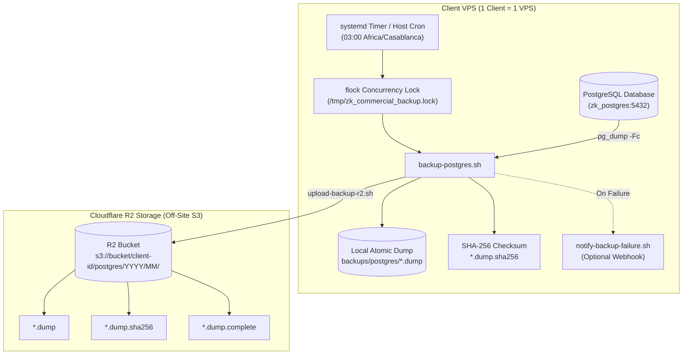

# PostgreSQL Backup, Off-Site Replication & Disaster Recovery Runbook

**Attendance System — Commercial Edition**

This runbook documents the architecture, automated scheduling, manual operations, security isolation, and disaster recovery procedures for PostgreSQL backups.

---

## 1. Architecture Overview



### Core Architecture & Safety Principles
- **One Client = One VPS:** Each client installation maintains its own isolated PostgreSQL database, local backup archive, and dedicated R2 prefix (`<BACKUP_CLIENT_ID>/postgres/YYYY/MM/`).
- **Atomic Creation:** Dumps are written to `.dump.partial` first, verified via `pg_restore --list`, and atomically renamed only upon validation.
- **Mandatory Integrity:** Every backup requires a valid SHA-256 sidecar (`.dump.sha256`).
- **Model A Authoritative Completion Marker:** Remote uploads place `.dump`, `.sha256`, and an atomic `.complete` JSON metadata marker. A backup is only deemed complete remotely when all 3 objects exist and match in size and checksum.
- **Concurrency Locking (`flock`):** Automated runs acquire a non-blocking lock to prevent overlapping backup executions.
- **Active Database Overwrite Protection:** Restore tools explicitly refuse to restore over the active application database (`POSTGRES_DB`).

---

## 2. Configuration & Credentials

### Local Environment (`.env.docker`)
Contains PostgreSQL connection details used by Docker Compose:
```bash
POSTGRES_DB=attendance
POSTGRES_USER=attendance_user
POSTGRES_PASSWORD=your_strong_password
```

### Off-Site R2 Environment (`.env.backup`)
Copy `.env.backup.example` to `.env.backup` on the host:
```bash
cp .env.backup.example .env.backup
```

Configure the following parameters:
```env
# Enable off-site upload
BACKUP_REMOTE_ENABLED=true

# Unique client identifier for logical bucket isolation
# Strictly alphanumeric, hyphens, and underscores (max 64 chars)
BACKUP_CLIENT_ID=client-acme-casablanca

# Cloudflare R2 Credentials
R2_ACCOUNT_ID=xxxxxxxxxxxxxxxxxxxxxxxxxxxxxxxx
R2_BUCKET=zk-k14-commercial-backups
R2_ACCESS_KEY_ID=xxxxxxxxxxxxxxxxxxxxxxxxxxxxxxxx
R2_SECRET_ACCESS_KEY=xxxxxxxxxxxxxxxxxxxxxxxxxxxxxxxxxxxxxxxx
R2_ENDPOINT=https://xxxxxxxxxxxxxxxxxxxxxxxxxxxxxxxx.r2.cloudflarestorage.com

# Retention (in days)
BACKUP_LOCAL_RETENTION_DAYS=7
BACKUP_REMOTE_RETENTION_DAYS=30

# Optional Failure Alert Webhook
BACKUP_ALERT_WEBHOOK_URL=https://hooks.slack.com/services/...
```

> [!CAUTION]
> Never commit `.env.docker` or `.env.backup` to Git. Both files are strictly ignored by `.gitignore`.

---

## 3. Client Isolation & R2 Permissions Model

### Application-Level vs Credential-Level Isolation
- **Application-Level Prefix Isolation (Enforced by Scripts):** All scripts (`upload-backup-r2.sh`, `download-backup-r2.sh`, `list-remote-backups.sh`) strictly enforce the `${BACKUP_CLIENT_ID}/postgres/` prefix. Any download or list operation targeting a different client prefix is rejected before making S3 calls.
- **Cloudflare R2 API Token Scope (Credential-Level):** Cloudflare R2 API Tokens currently support **Bucket-level** read/write scoping (e.g. restricted only to `zk-k14-commercial-backups`), but do not support granular path/prefix IAM policies inside a single bucket. Therefore, defense in depth is provided by combining restricted API tokens with application-level prefix enforcement.

---

## 4. Automated Production Scheduling

The automated scheduler is configured to trigger daily at **03:00 Africa/Casablanca** company time.

### Installing the Schedule (Idempotent Installer)

Run the included schedule installer:
```bash
# Option A: Systemd Timer (Recommended on Linux VPS)
sudo npm run backup:schedule -- --systemd

# Option B: Host Cron (with explicit CRON_TZ=Africa/Casablanca)
npm run backup:schedule -- --cron
```

### Checking Schedule & Logs
```bash
# Check status via helper
npm run backup:schedule -- --status

# Check systemd timer directly
systemctl list-timers zk-commercial-backup.timer

# View backup execution logs in journald
journalctl -u zk-commercial-backup.service -n 50 --no-pager
```

### Removing / Uninstalling Schedule
```bash
npm run backup:schedule -- --uninstall
```

---

## 5. Operational Commands Cheat Sheet

### 1. Create a Local Verified Backup
```bash
npm run backup
```

### 2. Create a Full Backup (Local + Off-Site R2 Sync)
```bash
npm run backup:full
```

### 3. List Local Backups
```bash
npm run backup:list
```

### 4. List Remote R2 Backups
```bash
npm run backup:remote:list
```
*Output displays status: `COMPLETE` vs `INCOMPLETE`.*

### 5. Download a Remote Backup from R2
```bash
npm run backup:remote:download -- <DUMP_FILENAME_OR_KEY>
```

### 6. Test-Restore into an Isolated Validation Database
Restores into a temporary database without touching production:
```bash
npm run backup:restore -- backups/postgres/<DUMP_FILE> [target_db_name] [--keep|--drop]
```

---

## 6. Disaster Recovery & Production Restoration

### Disaster Recovery Drill (Into Temporary Validation DB)
```bash
# 1. Download backup
npm run backup:remote:download -- attendance_2026-08-19_212910Z.dump

# 2. Restore into isolated test DB and retain for query validation
./scripts/restore-postgres.sh backups/postgres/attendance_2026-08-19_212910Z.dump attendance_dr_test --keep

# 3. Extract configured database user dynamically from .env.docker
POSTGRES_USER="$(grep -E '^POSTGRES_USER=' .env.docker | cut -d '=' -f2- | tr -d '\r\n"')"

# 4. Query and inspect restored tables in attendance_dr_test
docker exec zk_postgres psql -U "${POSTGRES_USER}" -d attendance_dr_test -c "SELECT count(*) FROM \"User\";"

# 5. Clean up temporary DR test database after inspection (Never drop POSTGRES_DB!):
docker exec zk_postgres psql -U "${POSTGRES_USER}" -d postgres -c "DROP DATABASE IF EXISTS \"attendance_dr_test\";"
```

### Production Full Database Ingestion (Controlled Bare-Metal Recovery)
When restoring a completely new production VPS:
```bash
# 1. Stop dashboard to prevent incoming web traffic during data load
docker compose --env-file .env.docker stop dashboard caddy

# 2. Extract database credentials dynamically from .env.docker
POSTGRES_USER="$(grep -E '^POSTGRES_USER=' .env.docker | cut -d '=' -f2- | tr -d '\r\n"')"
POSTGRES_DB="$(grep -E '^POSTGRES_DB=' .env.docker | cut -d '=' -f2- | tr -d '\r\n"')"

# 3. Ingest verified dump into primary database
docker exec -i zk_postgres pg_restore -U "${POSTGRES_USER}" -d "${POSTGRES_DB}" --clean --if-exists --no-owner --no-privileges < backups/postgres/<DUMP_FILE>

# 4. Restart full application stack
npm run docker:up
```

---

## 7. Local & Temporary Artifact Cleanup

To clean up old local test dumps or temporary verification databases safely:

### 1. Drop Temporary DR Databases
```bash
POSTGRES_USER="$(grep -E '^POSTGRES_USER=' .env.docker | cut -d '=' -f2- | tr -d '\r\n"')"
# Only drop databases explicitly named as test databases (NEVER POSTGRES_DB)
docker exec zk_postgres psql -U "${POSTGRES_USER}" -d postgres -c "DROP DATABASE IF EXISTS \"attendance_dr_test\";"
```

### 2. Clean Local Test Backup Files
```bash
# Remove specific old test dump files from backups/postgres/
rm -f backups/postgres/attendance_local_test_*.dump
rm -f backups/postgres/attendance_local_test_*.dump.sha256
rm -f backups/postgres/attendance_local_test_*.dump.complete
```

---

## 8. Credential Rotation Procedure

### Rotating Cloudflare R2 API Tokens
1. Log in to Cloudflare Dashboard $\rightarrow$ **R2** $\rightarrow$ **Manage R2 API Tokens**.
2. Click **Create API Token**:
   - Permissions: **Object Read & Write**
   - Bucket: Restrict to `zk-k14-commercial-backups`
   - TTL: As desired (e.g. 1 year)
3. Copy the new **Access Key ID** and **Secret Access Key**.
4. Edit `.env.backup` on the host VPS and update:
   ```bash
   R2_ACCESS_KEY_ID=<new_key>
   R2_SECRET_ACCESS_KEY=<new_secret>
   ```
5. Test connectivity:
   ```bash
   npm run backup:remote:list
   ```
6. Revoke the old API Token in the Cloudflare Dashboard.

---

## 9. Critical Operational Warnings

> [!WARNING]
> **DANGER — `docker compose down -v`**
> Running `docker compose down -v` permanently **DELETES** the PostgreSQL database volume (`zk_commercial_postgres_data`) and Caddy certificate storage.
> 
> **NEVER run `docker compose down -v` in production.**
> 
> Safe production shutdown command:
> ```bash
> npm run docker:down
> # (or: docker compose --env-file .env.docker down)
> ```
